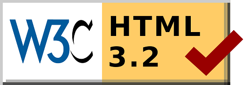

# Estrutura do HTML5

Para começar o assunto sobre HTML5, nada melhor do que apresentar aos mais leigos, um pouco da história desta linguagem. De acordo com a W3C (responsável por desenvolver padrões para a web), define que a web é baseada em 3 pilates:

* Um esquema de nomes para a localização de fontes de informação na web, esse esquema se chama URI;
* Um protocolo de acesso para acessar estas fontes, hoje o mais conhecido é o http;
* Uma linguagem de Hypertexto, para a fácil navegação entre as fontes de informação: o HTML;

Já que vamos abordar sobre o HTML, ele é basicamente uma abreviação de _Hypertext Markup Language_ (Linguagem de Marcação de Hypertexto). Esta é a linguagem responsável pela publicação de qualquer conteúdo na internet.

Desenvolvido originalmente por Tim Berners-Lee, o HTML é um conceito de hipertexto formado por um conjunto de elementos (ou nós) responsáveis por apresentar os conteúdos em uma página. Estes elementos podem ser palavras, imagens, vídeos, etc. Diferente de um texto comum onde um assunto é ligado a outro seguidamente, a conexão entre os elementos é algo imprevisto, mas que permite a comunicaçao de dados, organizando conhecimentos e guardando informações relacionadas.

O HTML tem como propósito ser uma linguagem entendida universalmente. Ela ganhou força quando Marc Andreessen desenvolveu o navegador Mosaic em 1990. A partir disso, desenvolvedores e fabricantes começaram a utilizar o HTML como base para compartilhamento de informações de forma padronizada.

Apesar de que o foco do HTML era padronizar a forma de publicação de conteúdo, entre 1993 e 1995, ela ganhou algumas novas versões (HTML+, HTML2.0, HTML3.0) mas só em 1997, a W3C trabalhou em uma versão 3.2 da linguagem, permitindo que ela fosse tratada como um padrão comum. O grande diferencial do HTML é sua interoperabilidade. Diferente das outras linguagens, esta não dependia de plataforma alguma, podendo ser desenvolvida e apresentada em diversos dispositivos.

